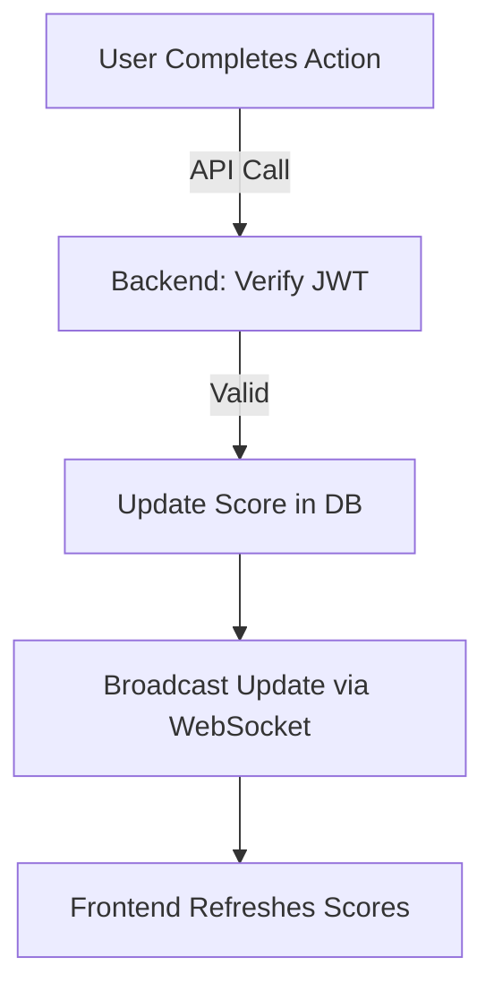

# Live Scoreboard API Module

## Overview
This module is designed to handle the live scoreboard functionality for a website. It ensures that user scores are updated in real-time and provides mechanisms to prevent unauthorized score tampering. The module uses efficient pagination, WebSocket for live updates, and JWT for authorization.

---

## Features
1. **Scoreboard Pagination**: Fetches the top 10 user scores with pagination support.
2. **Real-Time Updates**: Uses WebSocket for instant score updates.
3. **Secure Score Updates**: Ensures only authorized users can update their scores using JWT authentication.
4. **Frontend-Driven Updates**: Optimizes performance by leveraging the frontend for initial action handling.

---

## API Endpoints

### 1. **Fetch Top Scores**
   **`GET /api/scores`**
   - **Description**: Fetches the top 10 user scores with pagination.
   - **Query Parameters**:
     - `page`: (Optional) Specifies the page of results to fetch.
   - **Response**:
     - Status: `200 OK`
     - Body:
       ```json
       {
         "scores": [
           { "username": "user1", "score": 150 },
           { "username": "user2", "score": 140 }
         ],
         "page": 1,
         "totalPages": 5
       }
       ```

### 2. **Update User Score**
   **`POST /api/scores/update`**
   - **Description**: Updates a user’s score based on a completed action.
   - **Headers**:
     - `Authorization`: Bearer token (JWT)
   - **Request Body**:
     ```json
     {
       "username": "user1",
       "scoreDelta": 10
     }
     ```
   - **Response**:
     - Status: `200 OK`
     - Body:
       ```json
       {
         "message": "Score updated successfully",
         "newScore": 160
       }
       ```

### 3. **WebSocket Endpoint**
   **`/api/scores/updates`**
   - **Description**: WebSocket endpoint for subscribing to live score updates.
   - **Usage**:
     - Clients connect to this endpoint to receive real-time updates when scores change.

---

## Authentication and Authorization
- **JWT Authentication**: Users must include a valid JWT token in the `Authorization` header for all requests that modify scores.
- **Token Validation**:
  - Verifies the authenticity of the token.
  - Ensures the user’s role permits score updates.

---

## Real-Time Updates
- **WebSocket Flow**:
  - When a user’s score is updated, the server broadcasts the new score to all connected clients via the WebSocket.
  - Frontend clients can listen to the WebSocket stream to refresh the scoreboard instantly.

---

## Suggested Improvements
1. **Rate Limiting**:
   - Introduce rate limiting for score updates to prevent abuse.
2. **Audit Logs**:
   - Maintain a log of score updates for debugging and security audits.
3. **Performance Optimization**:
   - Cache the top scores to minimize database queries.
4. **Enhanced Security**:
   - Add IP and device fingerprinting to prevent token misuse.

---

## Diagram
The flowchart below illustrates the execution process:

1. **Fetch Scores**: Users request the top scores via a paginated endpoint.
2. **Update Score**: Users perform an action, triggering a score update request to the backend.
3. **WebSocket Update**: Backend broadcasts the updated scores to all connected clients.

### Diagram (Execution Flow)


---

## Tech Stack
- **Backend**: Node.js, Express
- **Database**: PostgreSQL
- **WebSocket**: Socket.IO
- **Authentication**: JSON Web Tokens (JWT)

---

## Installation
1. Clone the repository.
   ```bash
   git clone https://github.com/example/live-scoreboard-api.git
   ```
2. Install dependencies.
   ```bash
   npm install
   ```
3. Start the server.
   ```bash
   npm start
   ```

---

## Contributions
Feel free to raise issues or submit pull requests for improvements or bug fixes.

